# 学完《AI 时代研发效能提升落地实战》，我把 Harness Engineering 拆成了一套能跑的工程

## 写在前面

很多人对 AI 编码的判断还停留在"模型够不够强"。SWE-bench 的数字确实越来越好看了，但真把 agent 放进一个几百万行的项目里，它还是在同一批地方反复摔倒：happy path 跑通就汇报"完成"，没跑测试也敢说"已验证"，围着一个 500 错误反复改 Controller 而真正的根因在 schema，用户只想补一个字段它顺手把依赖升了级、API 改了名。

这些问题不是模型能力不够。有一个实验很能说明问题：同一个模型，别的都不动，只把它与代码交互的那一层（文件编辑接口）换一套实现，任务成功率就从 **6.7% 跳到 68.3%**。文件编辑接口不归模型，归 harness——它是 agent 周边的工程设施。模型一行没变，成功率却从个位数到六成多，说明之前低的不是模型能力，是承载它的设施太差，把模型真实的编码能力掩盖了。harness 的作用就在这：它不改变模型，只决定模型能发挥出多少。（出处：课程在讲 harness 核心框架时列的"关键实验数据"——"Can.ac 实验：同一个模型，仅替换文件编辑接口，任务成功率 6.7% → 68.3%"，同期还列了 LangChain 优化运行环境/上下文记忆/流程容错把基准从 52.8% 提到 66.5%。）

这套设施就是 harness。一个总纲式的判断是：**Agent = Model + Harness**（HashiCorp 联合创始人首提概念，OpenAI / Anthropic / Martin Fowler 跟进；嵌套关系 `Prompt ⊂ Context ⊂ Harness`——Harness 包含一切：工具、编排、记忆、护栏、评估）。工程师的角色从"写代码"变成"明确意图、设计环境、构建反馈回路"，人掌舵，agent 执行。

这篇文章不空谈理论，最终落点是一套已经跑起来的工程实现——`harness-engineering-kit`。它围绕一个判断展开：**模型决定上限，harness 决定底线**。直白点说：AI 写代码有三个致命问题——它会忘、它会绕、它会自己审自己；harness 不是让 AI 变聪明，而是让 AI 没有太多偷懒空间，把"是否完成"从 AI 的主观汇报，变成可检查的客观成果——这就是 Harness Engineering 设计的关键点。

下面先快速过一下这套工程的理论地基（含两种规约编程方案 Spec Kit / OpenSpec 与它们的扩展），再讲清楚主流 agent（Claude Code）的 AI 代码生成实践技巧，然后逐层拆开 `harness-engineering-kit` 的实现——每一层都回扣到上面的理论概念，最后用一个真实任务走一遍完整流程。

---

## 一、理论地基：从规约编程到 Harness

### 1.1 停止 vibe coding

直接用自然语言聊着改代码，快是快，但上下文是临时的、知识留不下来，代码越改越乱。它适合做 demo、做原型，不适合生产级项目。生产级要走另一条路：把"氛围编程"换成"工程化"，这是两种并列的核心范式，先用一张图看清两者的分野：

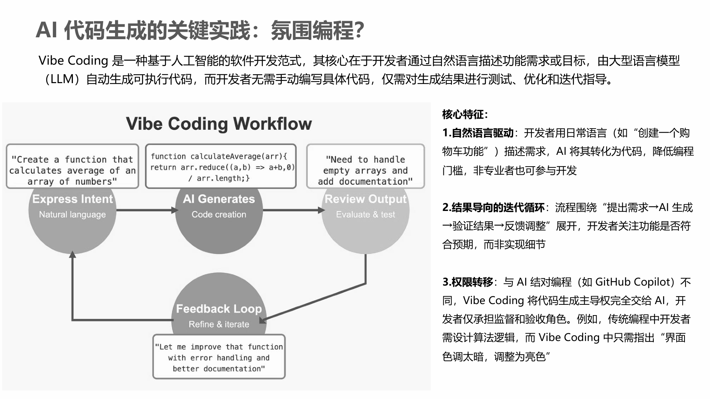

> 图：氛围编程（Vibe Coding）——自然语言驱动、上下文临时、走到哪算哪；快但混乱，适合 demo 不适合生产。对照的工程化范式见下表。

| 维度 | Vibe Coding（氛围编程） | Agentic Engineering（规约/工程化） |
|---|---|---|
| 角色 | 人是"提示词 DJ"，AI 是表演者 | 人是架构师 + 验收者，AI 是执行者 |
| 单元 | 对话（开放式，走到哪算哪） | 任务（明确输入/输出/验收标准） |
| 节奏 | 80% 快速完成 → 20% 事后补救（最难的部分） | 人前置 20% 判断 → AI 有效完成度趋近 100% |
| 后果 | 技术债以机器速度累积 | 规范定义"做什么"，测试定义"做到什么程度" |
| 金句 | — | **"同样 20%，放前面是投资，放后面是填坑"** |

Karpathy 2026.02 也说"该升级了"——**"从 0→1 可以 Vibe，从 1→10 必须 Engineering。决定竞争力的不是'你用不用 AI'，而是'你用 AI 的方式有没有工程纪律'"**。

生产级项目要走规约编程（Spec Coding）：先写规格说明（需求、设计、任务分解），再让 agent 按规格分阶段实现。这不是形式主义。规约编程的转折点是 spec 本身成为可以直接生成实现的蓝图——金融业务 AI Native 研发实践里的说法是：**"Spec 是唯一信息源，代码、测试用例是产物"**。传统开发里 spec 只是指导编码的文档，编码一开始就被抛弃；规约编程里 spec 贯穿始终，事后能追溯。

### 1.2 两个开源实现：Spec Kit 与 OpenSpec

规约编程有两个主流开源实现，定位不同、适用场景不同。

**GitHub Spec Kit** 是重量级方案。它是一套"工具 + 方法论"，通过一系列结构化的斜杠命令引导开发者和 AI 协同，把一个高层次的产品想法逐步细化为项目原则、功能规范、技术方案、任务列表，并最终自动执行实现。核心是五阶段流程，对应五条命令：

```
/constitution  → constitution.md   立规矩、定原则（项目"宪章"，最高优先级）
/specify        → spec.md           讲清楚需要做什么（用户故事/需求/实体/成功标准，用 Given/When/Then）
/plan           → plan.md           设计怎么做（技术栈/架构/API 契约雏形/数据模型，含 Constitution Check 门禁）
/tasks          → tasks.md          形成可执行步骤（TDD：每任务附测试，[P] 标可并行、[Story] 标归属）
/implement      → 代码              逐步生成代码（可指定 T001-T042 分段执行）
```

总公式：**宪章定义 → 需求说明 → 技术方案 → 任务分解 → 代码实现**（Constitution → Specify → Plan → Tasks → Implement）。Spec Kit 默认内嵌 TDD 实践，要求"先写失败测试再写实现代码"，严格执行 Red-Green-Refactor 循环。它的特点：完整严谨，但一个小功能要写一堆文档、token 消耗大，更适合从 0 到 1 的新项目，在存量项目里水土不服。

**OpenSpec** 是轻量级方案（`https://github.com/Fission-AI/OpenSpec/`，轻量级规范驱动开发 SDD 框架），也是更适合真实工程的那一个。它有四个设计原则：

| 原则 | 含义 |
|---|---|
| fluid not rigid（流动非僵化） | 无阶段门控，做有意义的事 |
| iterative not waterfall（迭代非瀑布） | 边构建边学习 |
| easy not complex（简单非复杂） | 轻量设置，最小仪式感 |
| **brownfield-first（棕地优先）** | **为现有代码库设计，不是为新项目** |

其中 **brownfield-first** 是和 Spec Kit（0-to-1 新项目）的关键差异点——OpenSpec 面向存量项目快速迭代。结构很简单：`specs/` 是事实来源（Source of Truth），描述系统当前行为，按业务领域组织；`changes/` 是变更提案，每个变更一个独立目录。一次变更只切一片需求，这片**需求切片**就是 delta，分 **ADDED / MODIFIED / REMOVED** 三种操作。流程三步：propose 创建变更、apply 执行、archive 把 delta 合并回主规范。

```
openspec/
├── specs/                  # 事实来源 Source of Truth，描述系统当前行为
│   └── <domain>/spec.md
└── changes/                # 变更提案 Proposals
    └── <change-name>/
        ├── proposal.md     # 为什么改、改什么
        ├── design.md       # 技术设计
        ├── tasks.md        # 实施清单
        └── specs/          # 对主规范的增量修改 Delta specs
```

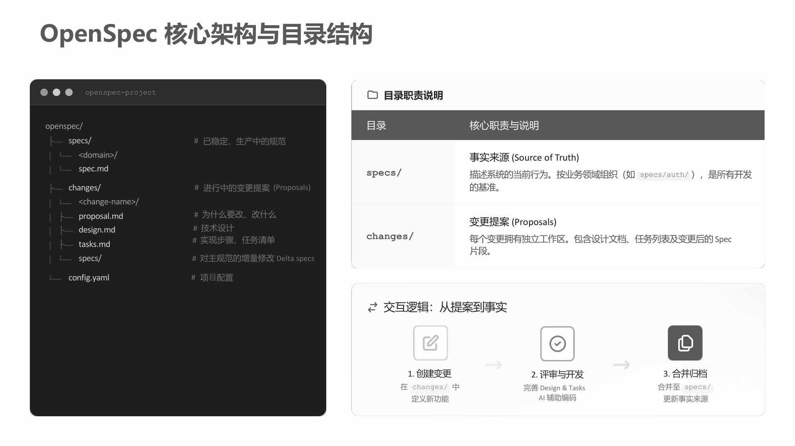

> 图：OpenSpec 的目录结构——`specs/` 是事实来源，`changes/` 是变更提案，每个变更一个独立工作区。

需求格式从规约编程的通用约定继承：需求语句用 **MUST / SHALL** 强约束关键字，场景用 **GIVEN / WHEN / THEN** 格式。比如一个 delta 片段：

```
## ADDED Requirements
### Requirement: Two-Factor Authentication
The system MUST require a second factor during login.
#### Scenario: OTP required
- GIVEN a user with 2FA enabled
- WHEN the user submits valid credentials
- THEN an OTP challenge is presented

## MODIFIED Requirements
### Requirement: Session Timeout
The system SHALL expire sessions after 30 minutes of inactivity.
(Previously: 60 minutes)

## REMOVED Requirements
### Requirement: Remember Me
(Deprecated in favor of 2FA)
```

三种 delta 的处理逻辑：ADDED 追加到主规范、MODIFIED 替换现有版本（必须标明变更前后差异）、REMOVED 从主规范删除（建议保留废弃原因）。OpenSpec 有两种工作模式：**Core Profile**（DEFAULT/FAST，默认精简模式，三步 `propose → apply → archive`，命令 `/opsx:propose`、`/opsx:explore`、`/opsx:apply`、`/opsx:archive`）适合日常快速迭代；**Expanded Profile**（EXTENDED/DETAILED，含验证与同步，`/opsx:verify` 三维度校验 Completeness/Correctness/Coherence）适合复杂变更管理。

这种"变更级、原子级、需求切片"的粒度比一份大而全的 PRD 好用得多。PRD 描述功能点，粒度粗，评审时人对着一大坨东西很难抠细节；一次变更只切一片，PO 评审的就是这一片需求切片，可追溯、可回滚。需求切片这个概念会贯穿整套 harness——后面第 6 层的状态机、第 8 层的 specs 归档，都是围绕"一次变更切一片、审一片、归一片"组织的。

### 1.3 从 OpenSpec 到基于 OpenSpec 的扩展：补哪三块

但原版 OpenSpec 有三个明显短板（"基于 OpenSpec 定制扩展研发工作流"案例里点明）：

1. **流程相对简单**——缺乏必要的代码审查（Code Review）和自动化测试环节，质量难以保证；
2. **经验无法沉淀**——历史问题和解决方案未被记录，导致相同错误在不同项目中反复出现；
3. **难以应对复杂场景**——单一直线式流程无法处理高复杂度、多模块协作的开发需求。

这三个短板正是把"个人工具"升级成"团队工程系统"的突破口，对应三项关键扩展：

| 扩展 | 内容 |
|---|---|
| **SubAgent 协作机制** | 预置 8 个专业 SubAgent 精细化分工，覆盖需求分析、架构设计、代码开发、代码审查及测试全流程 |
| **开发质量闭环** | 代码编写 → 智能审查 → 自动化测试，构建完整质量反馈回路 |
| **复利工程体系** | 结构化记录漏洞修复方案与最佳实践，构建知识库，实现知识复用与经验沉淀 |

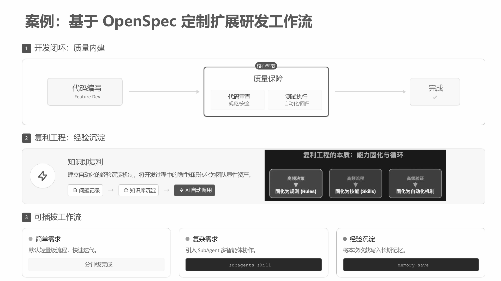

> 图：三项关键扩展——① 开发闭环（质量内建）② 复利工程（经验沉淀）③ 可插拔工作流，把"个人工具"升级成"团队工程系统"。

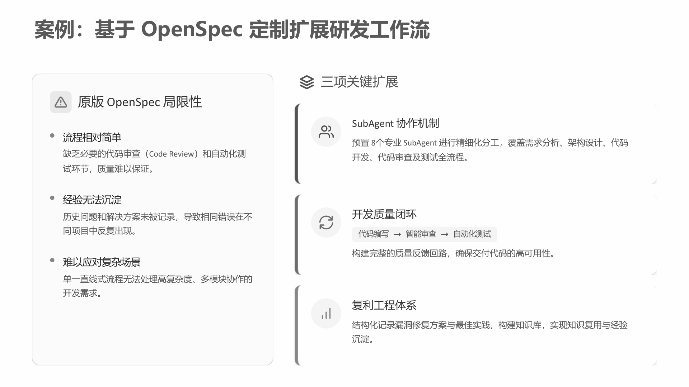

> 图：原版 OpenSpec 的三点局限（流程简单/经验无法沉淀/难应对复杂场景），正是扩展的切入点。

原版案例预置的 8 个 SubAgent 是"按技术栈分"的：

| SubAgent 角色 | 核心职责 |
|---|---|
| 需求分析师 | 理解需求，识别边界，生成结构化提案 |
| 方案架构师 | 技术设计，API 设计，任务分解 |
| 后端工程师 | 实现 Go 后端代码，遵循云 API 规范 |
| 后端审查员 | 审查 API 规范、安全性、性能问题 |
| 后端测试员 | 编写单元测试和集成测试 |
| 前端工程师 | 实现 React 前端组件和页面 |
| 前端审查员 | 审查组件设计、类型安全、性能优化 |
| 前端测试员 | 编写组件测试和 E2E 测试 |

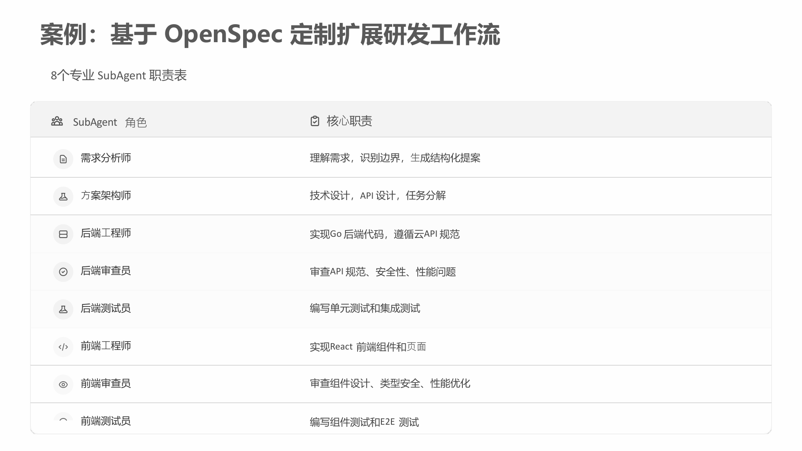

> 图：8 个 SubAgent 按"需求分析 → 架构设计 → 工程实现 → 审查 → 测试"链条分工，前后端各自形成"工程师 → 审查员 → 测试员"三人小组。

这背后是更广的行业共识——**"计划-执行-验证"三段式成为行业标准交互范式**：Anthropic 闭门圆桌（Stripe/NVIDIA/Google 等一致采用"测试先行"）、Gemini CLI（计划模式默认开启）、GitHub Copilot（Agent Hooks 在每个决策点注入校验）、Codex（Guardian Sub-Agent 守护者子代理审批其他 Agent 操作）、Cursor（35% PR 由 Agent 自主生成，云端 VM 独立构建测试）。对应到多智能体系统的经典模式就是 **Planner → Generator ⇄ Evaluator**：生成和评估形成反馈回路，不断互相纠偏。Anthropic 自己的编译器案例（16 并行 Claude Agent / 10 万行 Rust 写 C 编译器 / 99% 测试通过率）就是三智能体系统跑出来的。

> 为什么 CR 和 TE 必须分离？道理很直接：质量不靠 Agent 自觉，靠的是工程化流程强制——写代码的人不能自己判合格；判合格的人不能自己改代码。

还有一块是"怎么做"。最佳组合是 **OpenSpec + Superpowers**：OpenSpec 管"做什么"（流程），Superpowers 管"怎么做"（知识/SOP），二者正交组合。Superpowers（`github.com/obra/superpowers`）让 Agent 像高级工程师一样工作，六大核心能力是 TDD-First / Sub-Agents / Code Review / Exploration / Verification / Git Worktrees。协作原理是关注点分离：CLI 命令 + 规范文件（Markdown）定义 **WHAT**（做什么、验收标准），Superpowers 的 Skills 技能系统（自动触发的最佳实践文档）定义 **HOW**（TDD、子代理、审查），两套系统无 API 耦合，在同一 Agent 上下文中自动合并。

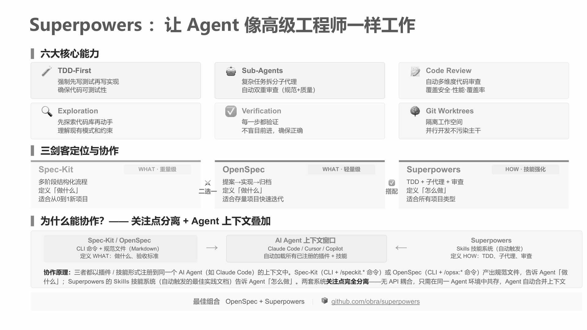

> 图：Superpowers 让 Agent 像高级工程师——TDD-First / Sub-Agents / Code Review / Exploration / Verification / Git Worktrees 六大能力，与 OpenSpec 正交组合（WHAT × HOW）。

在真实的大项目里验证一下：一个多年迭代、代码量超百万行的微服务项目，历史包袱沉重。用 vibe coding 改它，agent 会反复栽在四个坑里——上下文断层（只能看到当前文件几百行，对整体架构和历史问题一无所知）、重复解释（每次都要重新解释项目背景/技术栈/代码规范，烧 token）、乱改代码（按自己的理解"优化"，破坏原有业务逻辑）、过度设计（简单登录功能给你生成一整套 OAuth2 方案）。根因是两件事：**流程不规范 + 上下文缺失**，两者叠加就产生"幻觉"，代码和预期南辕北辙。

OpenSpec 只解决了其中一件——流程。把"随便聊改代码"换成"提案→实现→归档"的三段式，每个变更独立成片、可追溯，老项目不再水土不服。但**上下文问题依然存在**：agent 还是不知道这个项目有哪些"潜规则"。所以还要补 Skills——把技术架构、最佳实践、代码规范、历史约束封装成可复用的 Markdown 文档模块，相当于给 agent 准备的"项目入职手册"。这个项目整理了六大类共 45 条 Skills（开发规范/架构设计/微服务模块/技术专项/业务专项/工具方法），靠渐进式披露加载——先读元数据，按需加载，不一次灌满。

光有 Skills 文档还不够，得强制 agent 先读。方法是配一条"上下文优先规则"：接到需求先读相关 skill 文档，确认理解了模块的设计模式、代码规范、依赖关系，再动手改。完整工作流四步：① OpenSpec 在 `changes/` 建变更提案 → ② agent 按上下文优先规则自动加载相关 Skills → ③ 基于规格和上下文生成合规代码 → ④ 测试后归档，变更记录留痕可审计。

效果是两个真实案例对照出来的：**新增流水线变量功能**——以前 agent 不懂项目的数据结构（Map/List 该用哪个），来回拉扯 5 次后开发人员自己动手实现；现在 agent 先读 `pipeline-model-architecture.md` 和 `variable-extension.md`，一次性生成正确实现。**修复分布式锁 Bug**——以前 agent 建议一个 Redis 基础实现，忽略锁续期，上线后出问题；现在 agent 先读 `distributed-lock.md`，用 Redisson、遵循项目的 Key 命名规范，一次生成生产可用代码。区别就一句话：agent 不再"盲人摸象"，而是带着"地图"和"说明书"来工作。

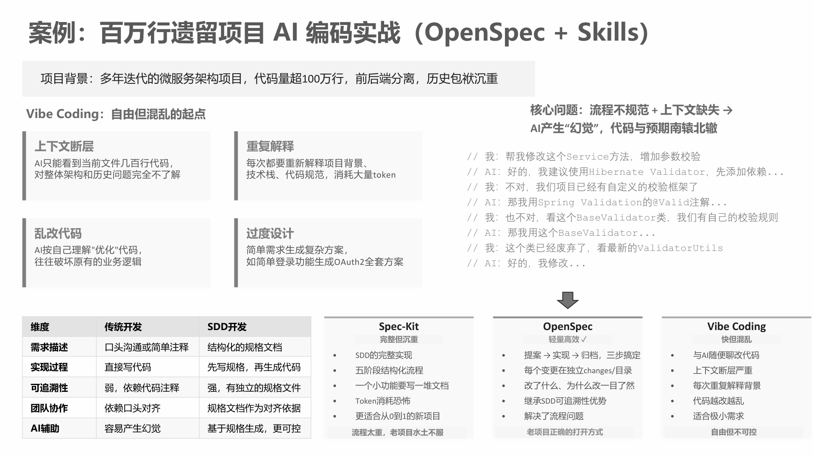

> 图：百万行遗留项目 AI 编码实战——Vibe Coding 的四大痛点（上下文断层/重复解释/乱改代码/过度设计），根因是流程不规范+上下文缺失；用 OpenSpec 补流程、Skills 补上下文，配"上下文优先规则"让 agent 先读文档再动手，流水线变量与分布式锁两个案例从反复返工变成一次过。

到这一步，规约、上下文、角色都在了，但它们还只是一组实践，不是一个系统。把它们焊成一个能让 agent"没有太多偷懒空间"的工程设施，就是 harness engineering。`harness-engineering-kit` 就是这套思路的落地——它在 OpenSpec 核心思想之上，把上面三项扩展工程化、可执行化。

---

## 二、主流 Agent 实践：Claude Code 的 AI 代码生成技巧

在拆 harness 之前，先说清楚"被 harness 包裹"的那个 agent 本身怎么用。以 Claude Code 为例（这套工程同样适配 Cursor、Copilot 等），它有几条值得单说的实践技巧。这些技巧本身就是"轻量 harness"——在还没有完整四层防线时，它们能帮你把单个 agent 用好。

### 2.1 Prompt 设计：约束比鼓励更重要

Claude Code 的 System Prompt 是动态组装的七层结构（身份定义 / 系统约束 / 任务规范 / 安全准则 / 工具使用 / 沟通规范 / 环境信息），中间有一条 `__SYSTEM_PROMPT_DYNAMIC_BOUNDARY__` 把 Prompt 分成可缓存的静态部分和每次重算的动态部分——边界前 Layer 1-6 静态 → API 跨请求缓存成本趋近 0，边界后 Layer 7 动态（CLAUDE.md / 记忆 / MCP 指令）→ 不破坏前缀缓存。

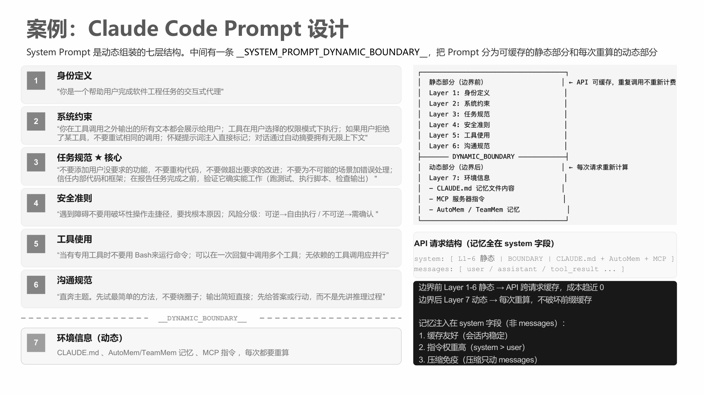

> 图：Claude Code System Prompt 的七层结构，中间的动态边界把可缓存静态部分与每次重算的动态部分隔开。

三条设计原则值得记：

1. **约束比鼓励更重要**——AI 的本能是"多做"，Prompt 的核心工作是约束它"只做被要求的"（"修一个 bug 不需要顺便清理周围代码""添加一个简单功能不需要额外的可配置性""不要给没改过的代码加文档/注释/类型注解"）。
2. **静态/动态分离优化成本**——不变指令放边界前缓存，变化内容放后面不破坏缓存命中。命名即约束：`DANGEROUS_uncachedSystemPromptSection`。
3. **规则要带原因，模型才能正确泛化**——不只说 what 要说 why（"默认不写注释。只有当 WHY 不明显时才加"）。

### 2.2 上下文工程：稀缺资源 + 不可能三角

上下文是稀缺资源。太多→响应慢、幻觉多、Tokens 消耗多；太少→丢失信息、无法正确回答。上下文管理有"不可能三角"（信息完整度 / 成本效率 / 响应速度，三选二）：200K 窗口全用上则每次请求都很贵、加载所有记忆文件则首 Token 延迟增大、极致缓存则缓存失效时更慢更贵。

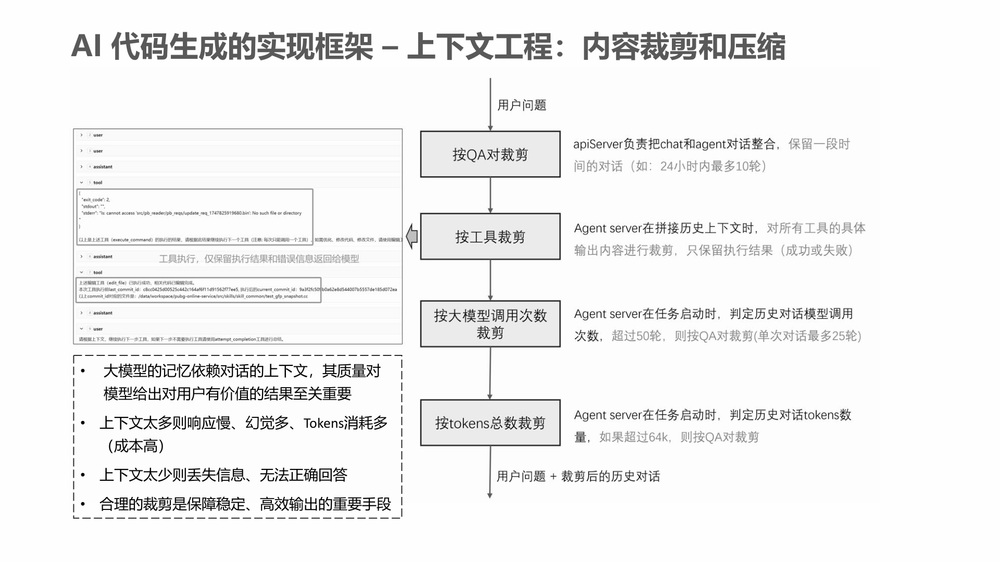

> 图：上下文工程——大模型记忆依赖对话上下文，合理裁剪是稳定高效输出的关键。

预算上有个数：`200K 窗口 - 20K 输出预留 - 13K 安全缓冲 = 167K 自动压缩阈值`——不是等到 200K 才压缩，167K 就开始动手。压缩有五种分层策略（按破坏性从轻到重：微压缩 / 缓存微压缩 / 自动压缩 / 响应式压缩 / 上下文折叠），自动压缩流程是七步：PreCompact Hooks → AI 生成摘要 → 太长则截断最旧消息重试（最多 3 次）→ 清除文件缓存 → 恢复关键文件（最多 5 个、每个 ≤5K Tokens）→ 重注入工具/Skill/MCP → PostCompact Hooks，带熔断（`MAX_CONSECUTIVE_AUTOCOMPACT_FAILURES`）。

一个常被忽略的点：**切换模型 = 缓存杀手**。会话中途换模型会让 Prompt Cache 完全失效，后续请求成本陡增。实践建议：一个会话内尽量不切换模型；需要用不同模型处理不同任务时，用子代理隔离。

### 2.3 记忆管理：双轨 + 两步保存 + 三不原则

Claude Code 有双轨记忆：**CLAUDE.md 指令记忆**（人工维护、每次请求必加载，分 Managed/User/Project/Local 四层）+ **AutoMem 自动记忆**（AI 提取生成、按相关性检索加载，分 User/Feedback/Project/Reference 四类）。

记忆入口是 `MEMORY.md` 索引（限制 200 行/25KB），格式是一行一个指针：

```
- [用户角色](user_role.md) — 后端架构师，Go 微服务
- [测试策略](feedback_testing.md) — 集成测试命中真实 DB
- [当前冲刺](project_timeline.md) — Q2 认证中间件重写
```

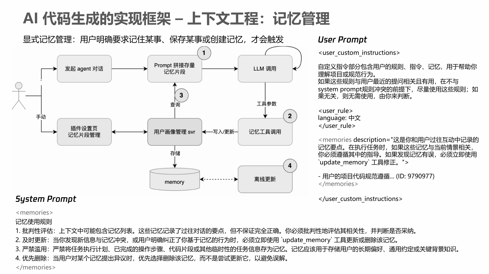

> 图：记忆管理——MEMORY.md 索引 + 两步保存法 + 三不原则。

两步保存法：Step 1 写 `.md` 文件（带 Frontmatter `name/type/`）→ Step 2 在 `MEMORY.md` 加索引指针；防重复（先查已有记忆再决定新建 or 更新）、防冲突（主代理已写记忆时跳过提取）。后台有 `extractMemories`（每轮对话后满足 Token 阈值就 fork 子代理不阻塞主对话、最多 5 轮）实时提取，还有 `autoDream`"做梦"机制（三重判断：距上次做梦≥N 小时 + 自上次整合完成≥N 个新会话 + 获得整合锁）定期整理——extractMemories 像边开会边记便签，autoDream 像会后整理会议纪要。

记忆三不原则要记牢：**不存可推导的**（代码能读到的不记）、**不存有权威源的**（Git log 是权威）、**不存临时的**（当前任务细节不值得跨会话保存）。严禁把任务执行计划、已完成的操作步骤、代码片段等临时信息存为记忆。

### 2.4 Rules / Skills / SubAgents / Docs 四件套

这是 AI 代码生成实现框架的分工总纲，也是后面 harness 四层防线的理论原型：

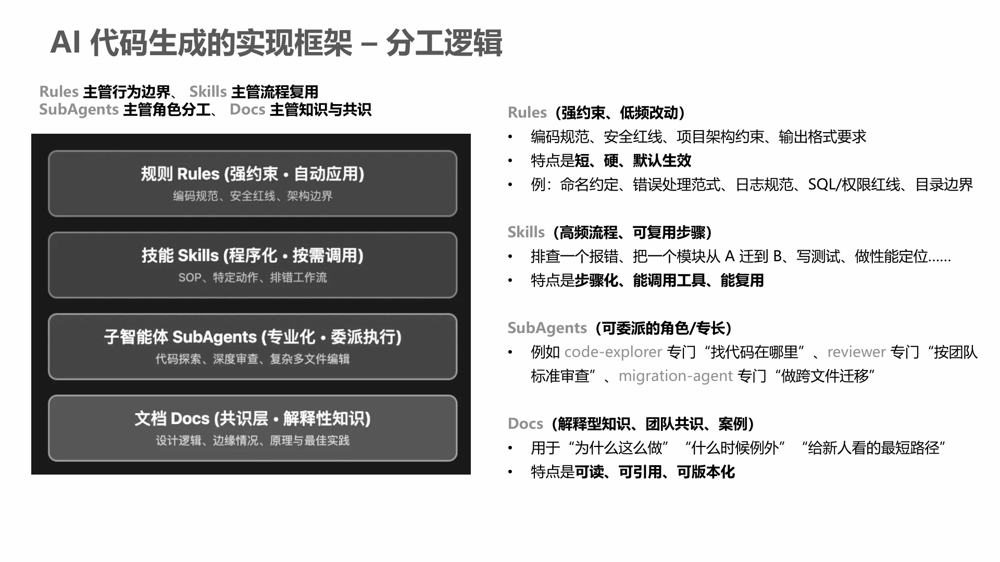

> 图：实现框架分工——Rules 强约束低频改动、Skills 高频流程可复用、SubAgents 角色分工、Docs 知识与共识，四者各管一摊。

| 组件 | 主管 | 特点 | 示例 |
|---|---|---|---|
| **Rules** | 行为边界 | 强约束、低频改动；短、硬、默认生效 | 命名约定、错误处理范式、目录边界 |
| **Skills** | 流程复用 | 高频流程、可复用步骤；步骤化、能调用工具、能复用 | 排查报错、模块迁移、写测试、性能定位 |
| **SubAgents** | 角色分工 | 可委派的角色/专长 | code-explorer 找代码、reviewer 审查、migration-agent 迁移 |
| **Docs** | 知识与共识 | 解释型知识、团队共识；可读、可引用、可版本化 | "为什么这么做""什么时候例外""新人最短路径" |

> Rule 说"所有 API handler 必须用 Zod 校验输入"（定义 What），Skill 说"Step1 npm test → Step2 后台起 server → Step3 curl /api/health 冒烟 → Step4 前端 build"（定义 How）。

三层的关系点得很透：Rule（规则）"每次修改后必须验证" → Skill（SOP）5 步构建验证流程 → Script（门禁）verify.sh 退出码 0/1 硬判定。越往右越"硬"，**Rule 可以被忽略，Skill 可以被跳步，Script 退出码无法伪造**——这正是后面 harness 四层防线"从软到硬"的理论来源。

落到大型代码库上，这个判断尤其成立——harness 比模型本身更决定实际效果：

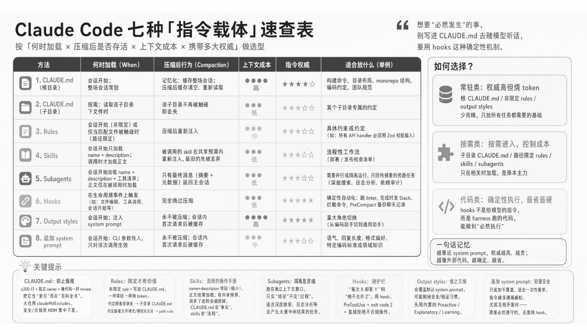

> 图：大型代码库的 Harness 实践——行动清单从"让代码库可导航"到"定期维护"五步，核心是围绕模型搭好工程设施，而非只追模型版本。

#### 契约优先的并行子代理

多任务要并行得起来，前提是拆得对。四条铁律：① 文件不重叠（每个子代理给独立目录或文件清单，绝不共享）② 无强依赖（B 不需要等 A 的输出，有依赖就串行）③ Scope 明确（每个子任务一句话能讲清"做完是什么样"）④ 主代理验证（子代理只交付，主代理负责跑测试 + 汇总）。反模式：✗ 同时改一个文件（两个子代理都改 `user.ts`，merge 必冲突）；✗ 强依赖却并行（"先建表，再写 API"必须串行）；✗ 一拆拆 10 个（Token 成本爆炸，先三个起步）。

第四条"主代理验证"是 harness 思维的缩影——子代理只交付，跑不跑测试、合不合格由主代理独立判定，不信任子代理的自述。这套思路在第 3 层 Agents+Workflow 和第 4 层 Scripts 里会被工程化放大。

#### 两条把单 agent 用好的纪律

还有两条偏操作、但同样呼应 harness 核心判断的纪律值得记：

- **方案没底就先 Plan，别边想边改**。Plan 模式只读探索、生成可改的方案、审批后再落地，本质是"先审后做"——和后面 propose 段末的人工卡点是同一个道理：深度逻辑交给人审，再放 agent 执行。经验上，Agent 反复改错 2 次就该回 Plan 重新规划，比追改快。
- **agent 打转就停**。看到它围着同一个症状反复打补丁，立即停（Esc / Stop）并回滚 checkpoint，不要等它自己收敛——这背后就是后面"轮次封顶防死磕"要拦的失控。

---

## 三、工程全貌：`harness-engineering-kit` 是什么

前面把理论和单个 agent 的用法讲完了，这一节起拆 `harness-engineering-kit` 本身。先看整个工程的骨架，再逐层钻进它的四层防线。`harness-engineering-kit` 复用了 OpenSpec 的核心思想（specs 作事实源、propose→apply→archive 三段式、SHALL+GWT、delta merge），在此基础上把第 1.3 节那三项扩展工程化：**角色制衡（七角色接力）、轮次封顶与回退表、硬门禁脚本、模块化知识地图加记忆库**。

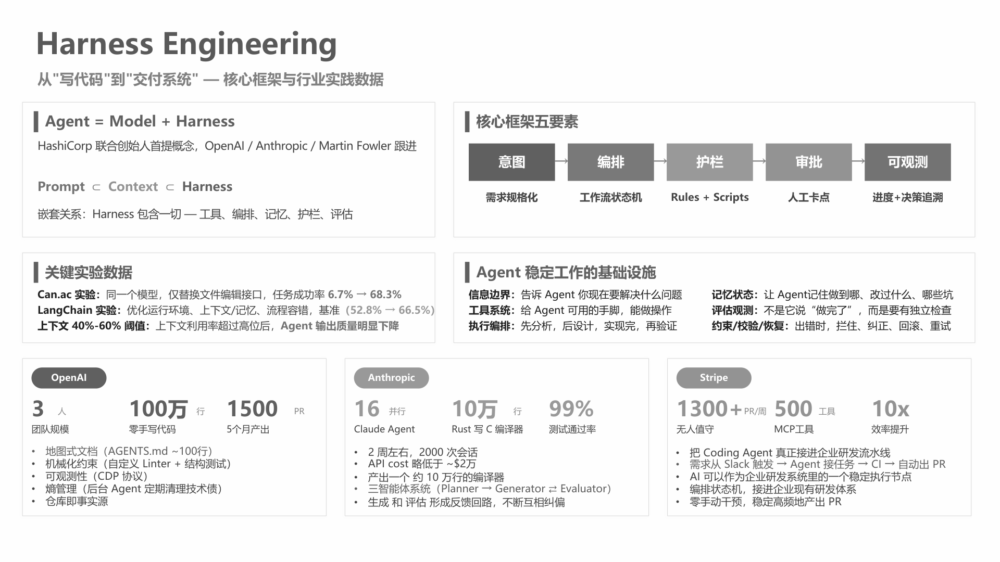

> 图：核心判断——**Agent = Model + Harness**（HashiCorp 首提，OpenAI/Anthropic/Martin Fowler 跟进），嵌套关系 `Prompt ⊂ Context ⊂ Harness`：Harness 包含工具、编排、记忆、护栏、评估一切。Can.ac 实验里"只换文件编辑接口、成功率 6.7%→68.3%"就是这一判断的实证。

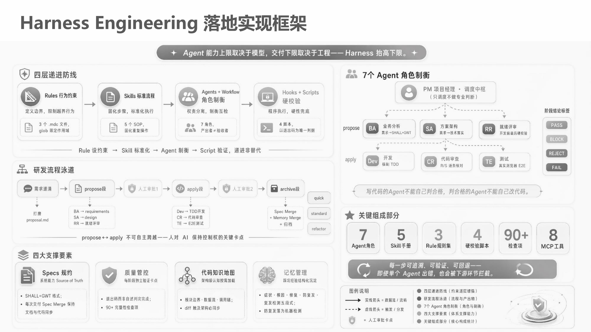

> 图：Harness Engineering 落地实现框架——意图层 / 执行层 / 保障层的总纲页，后续逐层展开。

目录结构长这样：

```
harness-engineering-kit/
├── AGENTS.md / CLAUDE.md        # 项目入口，AI 读的第一份文件，地图式
├── GUIDE.md                      # 工作流总览（三段命令 + 七铁律）
├── .cursor/rules/                # 第1层 Rules：3 个 .mdc（harness-core/code-standards/workflow-discipline）
├── .cursor/skills/               # 第2层 Skills：4 个 SOP（build-test/post-verify/code-review/test-e2e）
├── .cursor/agents/               # 第3层 Worker 子代理定义
├── .claude/settings.json         # Claude Code 等价 hooks 配置
├── .harness/                     # 核心工程工作流目录
│   ├── agents/                   # 7 个角色定义，每个内嵌五要素契约
│   ├── workflow/                 # transitions.json 状态机 + flow-definition + subagent-orchestration
│   ├── scripts/                  # 第4层 Scripts 硬门禁：verify.sh/baseline.sh/check-harness.sh + 脚手架
│   ├── hooks/                    # 3 个 hook 实现
│   ├── specs/                    # 系统能力 Source of Truth
│   ├── deliverables/             # 任务文档产出 + _template + _archive
│   ├── codebase-guide/           # 模块化知识地图（6 子文档）
│   ├── memory/                   # 记忆库（entries + templates + index）
│   └── board.md                  # 任务看板（状态机真实来源）
└── mcp-server/index.js           # 8 个 MCP 工具接口（可选增强）
```

注意双 IDE 对齐：`.cursor/` 和 `.claude/` + `.harness/` 是等价两套。`.harness/` 是 IDE 无关的核心，`.cursor/` / `.claude/` 是各自的载体适配。脚本一律用正斜杠加 `$(dirname ...)` 解析路径，跨 Git Bash / WSL / macOS / Linux 运行。

整套设计的核心骨架是**四层防线**，从软到硬逐层兜底——这正是第 2.4 节"Rule 可忽略、Skill 可跳步、Script 退出码无法伪造"的工程化放大：

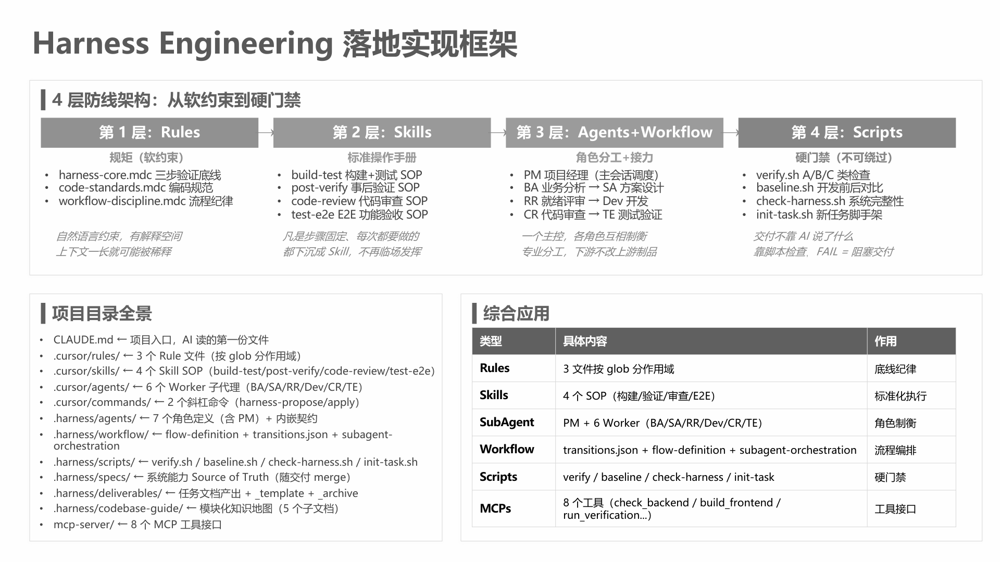

> 图：Harness 4 层防线架构——从软约束（Rules）到硬门禁（Scripts），越往下越不信任模型的自觉性，交付不靠 AI 说了什么，靠脚本检查。

```
第1层 Rules    声明意图，可被忽略、会被稀释
  ↓ 声明 ≠ 执行
第2层 Skills   SOP 手册，可被跳步
  ↓ 步骤可被跳
第3层 Agents + Workflow   角色制衡，单角色可糊弄
  ↓ 角色制衡
第4层 Scripts  退出码判定，无法伪造
  ↓ FAIL = 阻塞交付
```

上层靠"模型愿意听话"，下层靠"代码必然执行"。越往下越不信任模型的自觉性。这对应四层：Rules（软约束，harness-core.mdc/code-standards.mdc/workflow-discipline.mdc）→ Skills（SOP，build-test/post-verify/code-review/test-e2e）→ Agents+Workflow（角色分工+接力，PM/BA/SA/RR/Dev/CR/TE）→ Scripts（硬门禁不可绕过，verify.sh/baseline.sh/check-harness.sh/init-task.sh）。最"硬"的约束一句话：AI 说做完了没用，得跑过脚本这关才算。

下面逐层拆，每一层都回扣到第一节的理论概念。

## 四、第 1 层：Rules——声明意图

Rules 是注入到 agent 上下文的自然语言指令，声明"应该做什么"。它有三个 .mdc 文件，用 `globs` 和 `alwaysApply` 控制作用域——这是"限定才有价值"的实践：非限定 rule 等于写进根 CLAUDE.md，一样常驻、一样烧 token；路径限定 rule 只在匹配文件被触碰时进来，便宜。

`harness-core.mdc` 是 alwaysApply 的底线纪律，所有角色必守。它定义了"三步验证底线"——每个动作前后必想：做之前，这一步对应的 R-xxx/S-xxx 是什么？没有需求来源的动作不做；做之中，是否在改上游制品？是就停，BLOCK 让 PM 打回；做完后，有没有可验证的产出（文档 `## 结论` / 测试输出 / 退出码）？没有不算做完。措辞纪律是 `NEVER > Avoid > Prefer`，引用路径而不是复制代码（粘贴的代码会过时）。

`code-standards.mdc` 是路径限定的编码规范（glob `src/**/*.{js,jsx,ts,tsx}`），对照 verify.sh 的 A 类（静态规范）与 C 类（工程一致性）。`workflow-discipline.mdc` 是工作流纪律，编辑 harness 命令或 deliverables 文档时激活，讲接力赛规则、回退表、轮次封顶、心跳纪律。

但 Rules 有一个绕不开的弱点：**遵循率随上下文增长而衰减，是软约束，没有反馈闭环**——Rule 只是软约束，AI 会忽略（局部遗忘），也会绕过（找理由合理化违规）。所以它只能是第一层，下面要有兜底。

## 五、第 2 层：Skills——把固定步骤固化成 SOP

Rules 声明"该做什么"，Skills 说"怎么做"。区别用一个例子讲最清楚：Rule 说"所有 API handler 必须用 Zod 校验输入"（定义 What），Skill 说"Step1 npm test → Step2 后台启动 server → Step3 curl /api/health 冒烟 → Step4 前端 build"（定义 How）。

这套工程有四个 Skill，把固定流程下沉成 SOP，不再临场发挥：

- **build-test**：构建与测试验证 SOP。Dev 改完代码后触发。五步逐条执行不可跳步——预构建/迁移不跳步（改了 schema 先跑 `npm run data:import`）、全量单测、后台起 server 冒烟（curl /api/health 期望 200）、前端构建（戳记优化）、汇总 PASS/FAIL 表格。错误处理很关键：预构建失败就停报 PM，不要直接跑测试，否则报错根源会被掩盖。
- **post-verify**：事后验证 SOP。交付前跑 verify.sh + baseline compare + check-harness，形成证据闭环。价值一句话：Agent 可以骗你（"我测试通过了"），但脚本的退出码不会。
- **code-review**：代码审查 SOP。CR 按六维度审查（实现对照 design、规范符合、工程一致性、安全、可维护性、范围合规），问题进清单标严重度与归属，REJECT 按归属路由打回。
- **test-e2e**：E2E 功能验收 SOP。TE 从 requirements 的 Scenario 逐条生成 Playwright 用例，正向加异常各一，跑完用 check-e2e-evidence.py 校验证据闭环。

Skill 写到什么程度算合格？工程里有一条标准：**步骤要写到 agent 能"无脑执行"的程度。含糊 = 临场发挥 = 结果不可复现。如果一个 Skill 的某个步骤需要 agent 自行判断，说明这一步还不够具体。** 不同操作固化粒度不同——构建验证固化到命令级，需求分析固化到阶段级，但都可以做成 Skill。

Skill 也会被跳步，所以也是软的。它为 Rules 兜底，自己又需要被下一层兜底。这对应第 1.3 节"开发质量闭环"扩展——把"代码编写 → 智能审查 → 自动化测试"固化成可复用流程。

## 六、第 3 层：Agents + Workflow——角色制衡

这一层是这套工程把 OpenSpec"多 SubAgent 扩展"工程化的核心，对应第 1.3 节的"SubAgent 协作机制"扩展。

### 6.1 七角色接力

主会话扮演 PM（项目经理），**只做路由**——决定下一棒交给谁、何时停、何时升级给人。不给技术建议，不替 Worker 做专业判断。PM 下面拉起六个 Worker：

| 角色 | 阶段 | 产出 |
|---|---|---|
| BA（业务分析师） | propose | requirements.md（SHALL + GWT） |
| SA（解决方案架构师） | propose | design.md（refactor 档先做 impact-analysis） |
| RR（就绪评审员） | propose | readiness-review.md |
| Dev（开发者） | apply | 代码 + dev-log.md |
| CR（代码审查员） | apply | code-review.md |
| TE（测试工程师） | apply | test-report.md + 测试代码 |

这对应 OpenSpec 扩展案例里的 8 个 SubAgent，但做了两个改进。教材案例是"按技术栈分"（前后端各三个工程师/审查员/测试员），这里泛化成"按研发阶段分"（BA/SA/RR/Dev/CR/TE），更通用。更关键的是补上了 PM 这个只做路由的 Supervisor，对应经典三段式里的 Planner。整个接力对应 Planner → Generator ⇄ Evaluator：PM + BA/SA 是 Planner，Dev 是 Generator，CR + TE 是 Evaluator。

**CR 和 TE 分离是刻意的——写代码的人不能自己判合格，判合格的人不能自己改代码。** 这种交叉互审形成反馈回路：CR REJECT → Dev 修 → CR 复审；TE FAIL → Dev 修 → TE 复测。

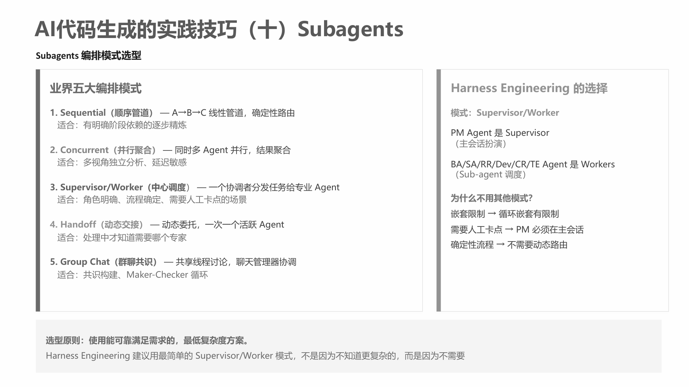

> 图：五大编排模式——Sequential / Concurrent / **Supervisor/Worker** / Handoff / Group Chat。harness 选 Supervisor/Worker（PM 当 Supervisor、6 Worker 接力），不是不知道更复杂的，而是不需要：确定性流程无需动态路由，人工卡点要求 PM 必须在主会话。选型原则是"能可靠满足需求的最低复杂度方案"。

### 6.2 五要素契约：每个角色怎么定义

每个 Worker 的 `.harness/agents/<role>.md` 内嵌五要素契约。这是这套工程很值得学的一个设计——角色不是靠自然语言描述，是靠结构化字段约束：

| 要素 | 说明 | 以 Dev 为例 |
|---|---|---|
| 身份宣言 | 我是谁、职责边界 | "我是 Dev，按 R-xxx 和 design 写实现，每完成一段跑测试与 verify…" |
| 必读文件清单 | 精确到路径（多了浪费，少了缺） | requirements + design + tasks + dev-recipes + 相关架构文档 |
| 输出格式模板 | 固定结构，下游能解析 | dev-log.md（一句话总结 + 测试执行摘要 + 改动清单 + 遗留风险） |
| 禁止事项 | NEVER 标记红线 | 改需求/改方案/降测试标准/伪造验证/超范围/跳预构建/错误死磕 |
| 完成条件 | 何时可停 | tasks 全勾 + npm test PASS + verify 无 FAIL + dev-log 已写 + hook verdict=PASS |

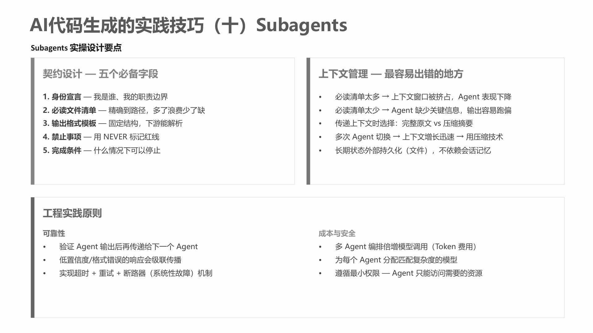

> 图：Subagent 契约设计的五个必备字段——身份宣言 / 必读文件清单 / 输出格式模板 / 禁止事项 / 完成条件。

必读文件清单的精度很关键。清单太多，上下文窗口被挤占，agent 表现下降；清单太少，缺关键信息，输出跑偏。SA 要读全栈架构加 deps，Dev 要读 overview 加 dev-recipes 加前后端架构，BA 只读 overview 和 harness-roles——每个角色只读它这个阶段需要的那几份。这背后是上下文工程的一条铁律（呼应第 2.2 节）：上下文是稀缺资源，过多指导反而无效，agent 会模式匹配而不是有意识导航。

禁止事项用 `NEVER` 强标记。Dev 的 NEVER 里有几条直指 agent 常见失控：不降测试标准（`toBe(5)` → `toBeGreaterThan(0)`、删失败用例、扩大 mock 范围）、不伪造验证（没跑命令就贴旧日志）、不超范围改动（用户要补字段不要顺手升级依赖/重命名 API/改表结构）、不错误死磕（围着症状打补丁，每轮修复引入新问题就停下来报 PM）。每一条都对应第 1.1 节列出的真实失控模式。

### 6.3 三段命令，两个人工卡点

```
/harness-propose <任务名> [需求描述]   → init → BA → SA → RR → [人工卡点 1]
/harness-apply   <任务名> [用户反馈]   → Dev → CR → TE → [人工卡点 2]
/harness-archive <任务名>              → Spec Merge + 归档 + board DONE
```

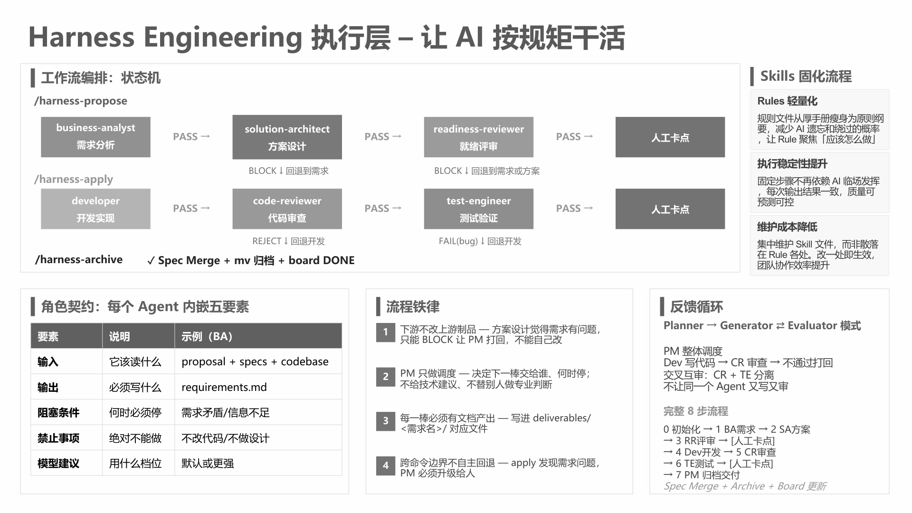

> 图：执行层——propose 段 BA→SA→RR→[人工卡点 1]、apply 段 Dev→CR→TE→[人工卡点 2]，状态机式的 PASS/BLOCK/REJECT/FAIL 路由，配角色契约五要素与四条流程铁律。

完整 8 步：0 初始化 → 1 BA 需求 → 2 SA 方案 → 3 RR 评审 → [人工卡点 1] → 4 Dev 开发 → 5 CR 审查 → 6 TE 测试 → [人工卡点 2] → 7 PM 归档。两个人工卡点是不可跳过的——propose 走完要人审 readiness-review，apply 走完要人审全量 deliverables。这是"深度逻辑需要交给人来审核"的落地（呼应 Plan 模式"先审后做"+ Claude Code 创始人的 "Verification Before Done：永远不要在没有证明有效的情况下标记任务完成"）。

### 6.4 信息流单向：下游不改上游

这是这套工程能运转的前提。proposal → requirements → design → 代码 → 测试 → 归档，信息单向流动，每棒的产出是下一棒的输入，下游只读上游不改上游。

反模式长这样：Dev 改了 requirements 没说 → SA/RR 基于旧需求审 → TE 按旧需求测 → 全链路失真，复盘时无法追溯。正确做法是发现上游问题就 BLOCK/REJECT，让 PM 打回上游重跑，绝不跨界。所以有三条铁律：下游不改上游制品、PM 只做调度、跨命令边界不自主回退。

跨命令边界不自主回退这条尤其重要。apply 阶段如果发现需求层问题（比如 TE 测出需求本身矛盾），PM 不能自己悄悄回 propose——必须升级给人，让人改 proposal 再重跑 propose。否则 propose 的产出和 apply 的实现会脱节，无法追溯。

### 6.5 三档 Profile：可插拔工作流

不是所有需求都走全流程。这是"可插拔工作流"的落地，定义在 `transitions.json` 里：

- **quick**：小需求、单点改动、不跨模块。BA → SA，SA 在 design.md 里写 `## 就绪自评` 替代独立 RR，跳过 RR。
- **standard**：常规功能、跨 1-2 模块。完整 BA → SA → RR。
- **refactor**：重构、大改、改数据模型、改公共契约。**先跑 `baseline.sh snapshot` 建基线**，再 SA 做影响面分析（impact-analysis.md），然后 BA → SA → RR。

PM 读 proposal 后识别 Profile，写进 board.md，抛心跳 `[PM] Profile 识别: <task> -> <profile> | 校验 PASS`。小需求走 quick 分钟级完成，复杂需求才引入完整多智能体协作。

### 6.6 状态机 + 回退表 + 轮次封顶

board.md 是状态机真实来源，任务行的状态随流程推进：

```
PENDING → PROPOSE_IN_PROGRESS → AWAITING_APPROVAL_1
       → APPLY_IN_PROGRESS → AWAITING_APPROVAL_2 → ARCHIVE_IN_PROGRESS → DONE
```

任意棒 FAIL/REJECT/BLOCK，阶段回退，但状态码保持 IN_PROGRESS（重试计数 +1）。`AWAITING_ARCHIVE` 状态下 PM 禁止改码，需返工时先诊断归属再调度 Worker。

回退表规定每一种失败打回给谁，PM 必须遵守不跨界：

| 发生阶段 | 失败模式 | 处理 | 跨界? |
|---|---|---|---|
| Propose 内 BLOCK | SA/RR 发现需求有问题 | PM 打回上游 BA 重跑 | 否 |
| Apply 内 CR REJECT | 代码审查不通过 | PM 按归属打回 Dev/TE/上游 | 否 |
| Apply 内 TE FAIL（实现级） | 测试发现代码 Bug | PM 打回 Dev | 否 |
| Apply 内 TE FAIL（需求级） | 测试发现需求层问题 | 升级给人 → 改 proposal → 重跑 propose | 是 |

轮次封顶防死磕（呼应第 1.1 节"错误死磕"失控）：Dev 最多 5 轮，CR 和 TE 各最多 3 轮，超限就暂停升级给人，禁止无界重试。这一条直接拦住"围着症状反复打补丁，Token 越烧越多"那种失控。

### 6.7 心跳纪律：让调度可观测

PM 在主会话每执行一个非 Read 工具动作，事务性地抛一条心跳。六类：Profile 识别 / 文档就位 / Task 开工 / 脚本事件 / Task 收工 / 异常告警。规则是一条心跳只绑定一个非 Read tool_use，tool 返回后先抛结果心跳，再进入下一动作。这让 PM 的调度过程可观测、可审计，不是黑箱。

---

## 七、第 4 层：Scripts——退出码说了算

这一层是这套工程真正区别于"一组实践"的地方。三层软约束都可能被绕过，第四层不会——退出码无法伪造。这正是第 1.3 节"开发质量闭环"扩展里"自动化测试"的硬落地，也是"Agent 可以骗你（'我测试通过了'），但脚本的退出码不会"的工程实现。

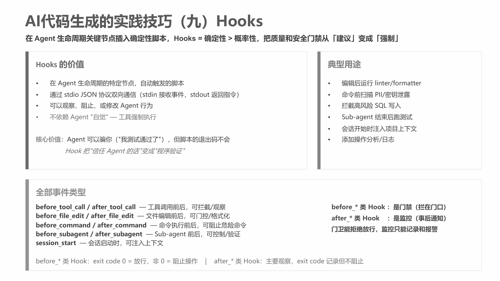

> 图：Hooks 的定位——Hooks = 确定性 > 概率性，把质量和安全门禁从"建议"变成"强制"。

### 7.1 verify.sh：交付前总验证

分 A/B/C 三类检查，区分 FAIL（阻塞交付）和 WARN（只记录不阻塞）：

| 类别 | 内容 | 典型项 |
|---|---|---|
| A 静态规范 | A1-A8 | ES Module(FAIL) / asyncHandler(WARN) / timestamps(FAIL) / 路由有 Controller(FAIL) / 无硬编码端口(FAIL) / 单文件 ≤300 行(WARN) / 无残留 console.log(WARN) |
| B 交付门槛 | B1-B2 | 前端 build 成功(FAIL) / seeder 语法正确(FAIL) |
| C 工程一致性 | C1-C6 | 路由注册进入口(FAIL) / Screen 进入口(FAIL) / Model export default(FAIL) / API Slice 用 injectEndpoints(FAIL) / errorMiddleware 注册(FAIL) / 前端无直接 fetch(WARN) |

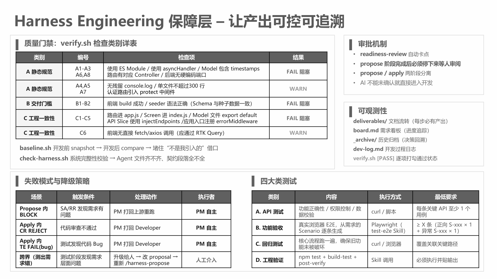

> 图：verify.sh 检查类别详表——A 静态规范 / B 交付门槛 / C 工程一致性三类，区分 FAIL 阻塞与 WARN 记录，附 baseline.sh 与 check-harness.sh 定位。

退出码 0 是全过（可有 WARN），1 是有 FAIL。**FAIL = 阻塞交付**。这份清单和 CR 的六维度审查是对齐的——CR 按 design 对照实现、按 code-standards 查规范、按 verify.sh A/C 类查一致性，审查的依据就是脚本要校验的东西。

脚本设计有几个细节值得学。它用 `set -uo pipefail`，解析仓库根用 `$(dirname ...)` 而不硬编码路径。有 `has_rg` 检测，有 rg 用 rg、没有降级 grep——功能等价，只是少了格式化。这种降级策略让脚本在不同环境都能跑。

### 7.2 baseline.sh：堵"不是我引入的"借口

refactor 档在 propose 前先跑 `baseline.sh snapshot`，存一份基线（verify 结果 + 测试用例数）到 `.harness/baseline/<task>.json`。开发后跑 `baseline.sh compare`，**只看新增 FAIL**——verify 由 PASS 退化成 FAIL、或者测试数减少了，就是这次改动引入的。

这一条直接堵住两类问题。一是甩锅："这个 FAIL 历史就有的，不是我引入的"——baseline 一比对，开发前是 PASS 开发后变 FAIL，甩不了。二是跳过预构建和迁移（呼应第 1.1 节"跳过步骤"失控）：改了 schema 不跑迁移，baseline compare 一下就露馅，因为测试数会下降或 verify 会退化。compare 退出码 1 = 存在新增 FAIL，不可交付。

### 7.3 check-harness.sh：harness 自己的完整性

校验 harness 自己的结构完整性：7 个角色文件齐不齐、每个 agent 内嵌的五要素段落（身份宣言/输入/输出/禁止事项/完成条件）全不全、workflow 三件套在不在、scripts 硬门禁在不在、codebase-guide 6 个子文档在不在、board.md 和 specs/_index.md 在不在。archive 终检时也跑它，FAIL 就 PM 修，3 轮修不动回滚升级给人。

这一步的意义是：harness 自己也会腐化（有人删了脚本、有人改了 agent 契约忘了同步），得有元检查保证 harness 本身可用。

### 7.4 Hooks：把"信任 agent 的话"变成"程序验证"

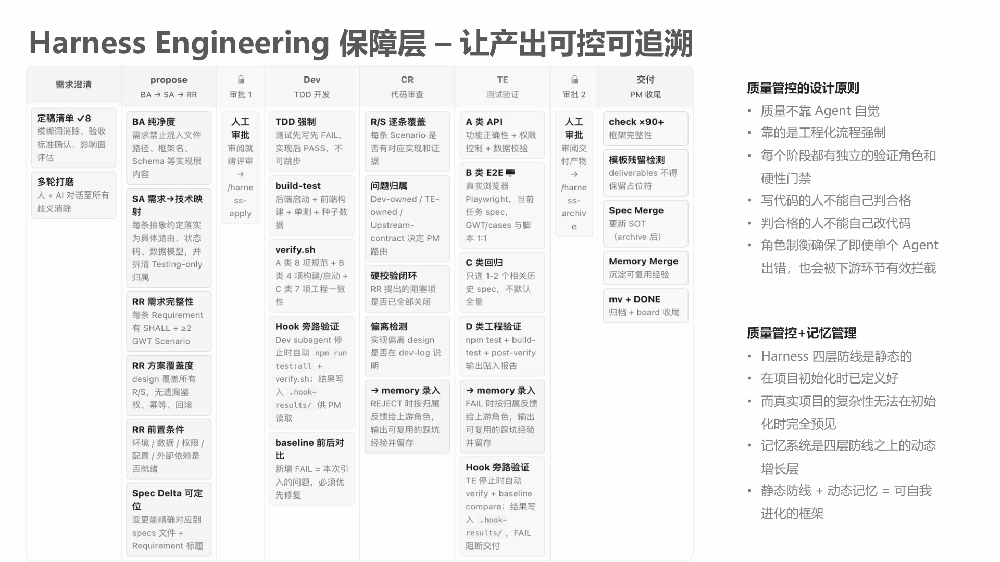

> 图：保障层——质量不靠 Agent 自觉、靠工程化流程强制；写代码的人不能自己判合格、判合格的人不能自己改代码；静态四层防线 + 动态记忆 = 可自我进化的框架。

这是第四层里最关键的一环。`.claude/settings.json` 注册了四类事件，三个 hook 实现：

```
SubagentStop  matcher=developer     → verify-after-developer.js  (Dev 停 → 自跑 npm test + verify)
SubagentStop  matcher=test-engineer → tester-evidence.js         (TE 停 → E2E 证据闭环 + verify + baseline)
PostToolUse   matcher=Write|Edit    → prettier --write            (格式化)
PreToolUse    matcher=Bash          → guard-dangerous.js          (拦危险命令, exit 2 拒绝)
SessionStart                       → echo 上下文已加载
```

看 `verify-after-developer.js` 的设计（这是真实文件，不是示意图）。触发条件是 developer 子代理停止。它读 stdin JSON 确认 `agent_name == "developer"`，然后**不问 Dev，程序自己跑 `npm test` + `verify.sh`**，退出码无法伪造：

```javascript
// 1. npm test
const testOut = run('npm test', 120000);
const passed = (testOut.match(/(\d+)\s+passing/i) || [])[1] || '0';
const failed = (testOut.match(/(\d+)\s+failing/i) || [])[1] || '0';
const testPass = Number(failed) === 0 && /passing/i.test(testOut);

// 2. verify.sh
const verifyOut = run('bash .harness/scripts/verify.sh', 120000);
const verifyPass = /结论: verify\.sh PASS/.test(verifyOut);

const verdict = testPass && verifyPass ? 'PASS' : 'FAIL';

resp.followup_message =
  `[developer hook] verdict=${verdict}\n` +
  `  npm test: ${testPass ? 'PASS' : 'FAIL'} (${passed} passed, ${failed} failed)\n` +
  `  verify.sh: ${verifyPass ? 'PASS' : 'FAIL'}\n` +
  (verdict === 'FAIL'
    ? `  PM 行动：verdict=FAIL → 重拉 Developer（重试计数+1，上限 5）；不要信任 Dev 自述。`
    : `  PM 行动：verdict=PASS → 进入 CR（code-reviewer）。`);
```

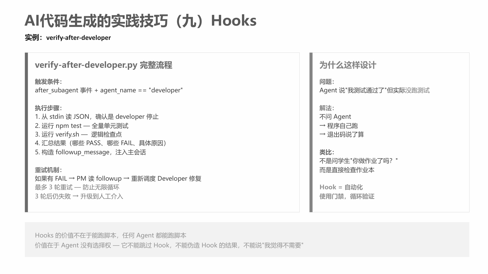

> 图：verify-after-developer hook——触发条件 after_subagent(developer)，不问 Agent，程序自跑 npm test + verify.sh，退出码说了算。

为什么这样设计？工程文件里写得很直白："Agent 可能说'我测试通过了'但实际没跑。Hook 不问 Agent，程序自己跑，退出码无法伪造。" 类比是：不是问学生"你做作业了吗"，而是直接检查作业本。

Hook 的价值不在能跑脚本——任何 agent 都能跑脚本。价值在于 **agent 没有选择权**：它不能跳过 Hook，不能伪造 Hook 的结果，不能说"我觉得不需要"。Hook 完全绕过压缩、绕过模型的自觉，是 harness 跑的代码，不是给模型的指令。这一层是整条防线里 agent 唯一没有选择权的一环。按触发时机分：before_* 类 Hook 是门禁（exit code 非 0 阻止操作），after_* 类 Hook 是监控（记录但不阻止）。verify-after-developer 是 after_subagent，属于监控+反馈——操作已完成，但用程序验证结果反馈给 PM。

---

## 八、知识底座：静态地图 + 动态记忆

四层防线是静态的，初始化时定义。但真实项目的复杂性没法在初始化时全部预见，所以上面还有一层动态增长层——对应第 1.3 节"复利工程体系"扩展。

### 8.1 codebase-guide：渐进式披露的地图

六个子文档：overview（项目架构总览）、backend-arch、frontend-arch、deps（依赖与版本锁定）、dev-recipes（开发场景配方，如何加路由/Model/Screen）、harness-roles（角色职责速查），加一个 index 入口。

index 里有一张"按角色必读"的表是渐进式披露的关键——BA 只读 overview 和 harness-roles，SA 要读全栈架构加 deps，RR 读 overview 和 harness-roles，Dev 读 overview 加 dev-recipes 加前后端架构，CR 读架构和 deps，TE 读 dev-recipes 和 harness-roles。**先读 index，按角色决定读哪几份子文件，不一次全读。** 这对应 OpenAI Codex 实践里那份 100 行 AGENTS.md 当地图、指向 docs/ 各子目录的做法。背后纪律是"仓库即真相源"：agent 看不到的等于不存在，所以一切要入仓库、版本化。

### 8.2 specs：Source of Truth

specs 随交付逐步建立。每次 archive 时 PM 把 delta 合并进对应 `specs/<capability>/spec.md`。格式从 OpenSpec 继承：`### Requirement:` 用 SHALL/MUST 强约束，`#### Scenario:` 恰好 4 个 `#`，GIVEN/WHEN/THEN。比如 orders 的 spec：

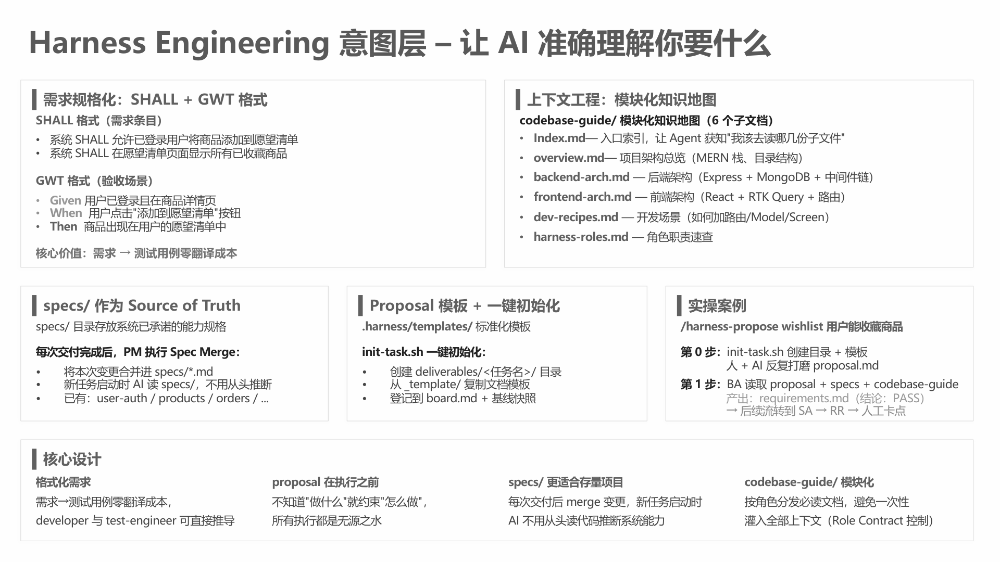

> 图：意图层——需求规格化用 SHALL + GWT（Given/When/Then），核心价值是"需求→测试用例零翻译成本"，developer 与 test-engineer 可直接推导；specs/ 作 Source of Truth，codebase-guide/ 按角色分发必读文档（Role Contract 控制），避免一次性灌入全部上下文。

```
### Requirement: 下单前手机号校验
系统 SHALL 在用户下单前，校验其账户已填写有效手机号；未填写则阻断下单并提示补全。

#### Scenario: 未填手机号下单被阻断
- GIVEN 一个未填写手机号的登录用户，购物车有商品
- WHEN 用户提交订单
- THEN 系统阻断下单并提示"请先填写手机号"，提供跳转到资料页的入口
```

这种格式的好处是 TE 直接照着 Scenario 生成 Playwright 用例，零翻译成本。R-xxx/S-xxx 编号贯穿全链路——BA 写需求时编号，TE 据此生成测试，CR 据此审查。

### 8.3 memory：动态记忆

memory 是四层防线之上的动态增长层，archive 阶段 PM 执行 Memory Merge，把可复用经验写进 `entries/`。条目格式是"问题场景 + 解决方案"，比纯规则更易被 AI 理解。三个示例条目：换号登录语言覆盖缺陷、跳过迁移掩盖报错根源、E2E 伪造验证。

memory 和 specs 互补：**specs 是系统能力契约，memory 是踩过的坑和解法。** 维护纪律是删过时经验前先验证现有代码是否仍用该模式。静态防线加动态记忆，框架就能自我进化——这正是 OpenSpec"经验无法沉淀"那个短板的解法。这层和 Claude Code 自己的记忆管理（第 2.3 节 MEMORY.md 索引 + 两步保存）是同构的，只是 harness 把它变成了团队级、入仓库的工程资产。

---

## 九、走一遍完整流程：拿一个真实需求跑通

光讲结构抽象，不如真跑一遍。下面这个任务是在 `harness-engineering-kit` 仓库里**真实执行**的：`/harness-propose` 那套斜杠命令和 `SubagentStop` hook 是 IDE 层机制，脱离 Cursor/Claude Code 的运行时无法自动触发；但脚手架脚本（init-task / check-harness / verify / hook 实现）是纯 bash+node，可以在终端真实跑。所以这一节的七角色接力由我以 PM 身份手动驱动各 Worker、按 `.harness/agents/*.md` 的五要素契约逐棒产出文档，而所有脚本和 hook 的输出都是真实终端跑出来的截图——不是示意，是退出码说了算。

任务：`user-switch-stale-ui`——换号登录后界面语言被账户语言强制覆盖（john 登出后 jane 登录，Header 语言被强制回退到 jane 的账户语言 zh，破坏了用户当前已选的英文）。standard 档。

### 第 0 步：初始化（init-task.sh 真实运行）

真实运行脚手架，建 deliverables 目录、复制 `_template`、登记 board.md：

```
$ bash .harness/scripts/init-task.sh user-switch-stale-ui standard
[init-task] 已创建: .../deliverables/user-switch-stale-ui
[init-task] 已复制模板文档（proposal/requirements/design/.../tasks.md）
[init-task] 已登记 board.md: ID=041, profile=standard, 状态=PENDING
[init-task] 完成。下一步：人 + AI 反复打磨 proposal.md，确认定稿后进入 propose 链路。
[exit code: 0]
```

PM 读 proposal.md 识别 Profile：proposal 里写明"不涉及后端/数据模型/公共契约变更 → profile=standard（非 refactor）"，抛心跳 `[PM] Profile 识别: user-switch-stale-ui -> standard | 校验 PASS`，board 写 profile=standard。

### 第 1 步：BA 需求分析

PM 拉起 business-analyst，输入是 proposal + specs + codebase-guide/overview。BA 把 proposal 的模糊意图转成结构化需求，产出 `requirements.md`：

```markdown
### Requirement: R-012 换号登录保留当前界面语言
系统 SHALL 在同一会话内换号登录（A 登出后 B 登录）时，保留当前界面语言，而非用 B 的账户语言覆盖。

#### Scenario: S-023 john 英文登出后以 jane 登录
- GIVEN john 已将界面切换为英文并登出，jane 的账户语言偏好为 zh
- WHEN jane 登录成功
- THEN Header 语言保持英文（保留当前界面语言），不回退到中文

#### Scenario: S-024 首次登录应用账户语言
- GIVEN 一个无本地界面语言记录的新会话，jane 账户语言偏好为 zh
- WHEN jane 登录成功
- THEN 界面应用 zh（首次登录用账户语言初始化）
```

注意 BA 写了两个 Scenario：一个是换号场景（正向），一个是首次登录场景（异常/边界）。异常分支才是 bug 藏身处，BA 不能只写 happy path。编号 R-012/S-023/S-024 贯穿全链路。末尾 `## 结论 PASS` 交回 PM。

### 第 2 步：SA 方案设计

PM 拉起 solution-architect，输入是 requirements + specs + 前后端架构 + deps。SA 把"做什么"转成"怎么做"，产出 `design.md`（节选）：

```markdown
## Context
登录成功回调当前逻辑：setUiLanguage(res.uiLanguage || 'zh')。
这会在任何登录成功时用账户语言覆盖当前界面语言，破坏换号场景的"保留当前选择"语义。

## Goals / Non-Goals
**Goals:** 换号登录时保留当前界面语言；首次登录时仍用账户语言初始化。
**Non-Goals:** 不重写 i18n 持久化机制；不改账户语言偏好 UI。

## Decisions
决策：登录成功回调按"本地是否已有界面语言"分支
- 有本地语言 → 保留，仅更新账户偏好到 profile（不调 setUiLanguage 覆盖）。
- 无本地语言 → setUiLanguage(res.uiLanguage || 'zh')（原逻辑）。
备选：始终不覆盖 → 否决，会破坏首次登录用账户语言的 S-024。

## 就绪自评
- [x] 需求全部有方案覆盖（R-012 → 分支修正）
- [x] 无超范围改动（仅回调分支 + E2E）
- [x] 风险均有缓解
- [x] 任务可被 Dev 一次性执行（无暗知识）
- [x] 兼容现有公共契约（不改 i18n spec 既有 Requirement，仅 ADDED 新条）
```

Non-Goals 是防"小题大做"的（呼应第 1.1 节"小题大做"失控）——明确说不重写 i18n 持久化、不改账户语言 UI，把范围钉死。Decisions 里写了备选方案和否决理由，不只写"选了 X"。就绪自评五项全勾，末尾 `## 结论 PASS`。

### 第 3 步：RR 就绪评审

standard 档要过 RR。RR 像一个没参与设计的旁观者，用白纸视角找问题：需求可测性（每个 R-xxx 能否被 TE 推导成测试）、方案可行性、范围合规（是否超 proposal）、暗知识检查（任务拆解能否被 Dev 一次性执行，有没有"你应该知道"的隐含前提）、契约兼容。六项评审填完，无阻塞，`## 结论 PASS`。

### 人工卡点 1

PM 抛 `[PM] 人工审批 1: user-switch-stale-ui ... 请审阅 readiness-review.md`。人审完确认，进入 apply 链路。

### 第 4 步：Dev 开发实现 + hook 程序验证

PM 拉起 developer，输入是 requirements + design + tasks + dev-recipes。Dev 按 tasks 顺序实现。**这里有一次真实的失败闭环**：Dev 首次实现没加分支，登录回调仍是 `setUiLanguage(res.uiLanguage || 'zh')` 覆盖。

Dev 停下来后，`after_subagent` hook 的真实实现 `verify-after-developer.js` 会被触发——它不问 Dev，程序自己跑 `npm test` + `verify.sh`，退出码无法伪造。下面是这个 hook 在终端真实运行的输出（构造一个模拟的 `after_subagent(developer)` 事件喂给它）：

```
$ echo '{"event":"after_subagent","agent_name":"developer","exit_code":0,"files_changed":[...]}' \
    | node .harness/hooks/verify-after-developer.js
{"decision":"allow","followup_message":"[developer hook] verdict=FAIL
  npm test: FAIL (0 passed, 0 failed)
  verify.sh: FAIL
  PM 行动：verdict=FAIL → 重拉 Developer（重试计数+1，上限 5）；不要信任 Dev 自述。
  摘要：[FAIL] A1 未声明 ES Module（package.json 缺 type:module） | [FAIL] C1 路由未注册进应用入口 | ..."}
[exit code: 0]
```

注意几件事：① hook 的输入里 `exit_code:0`（Dev 自己说成功了），但 hook 程序自跑后给出 `verdict=FAIL`——这正是"Agent 可以骗你，但脚本退出码不会"的实证，hook 完全不信任 Dev 的自述。② 这条输出的 FAIL 有个细节值得说清楚：`npm test` 和 `verify.sh` 在本仓库里是真的会 FAIL，因为这个仓库是**harness 工程脚手架本身，不含业务应用源码**（没有 `package.json type:module`、没有路由注册进 `app.js`）。换句话说，脚本是按"真实应用该有什么"去校验的，缺什么就如实报什么——它不会因为"这是演示"就放水。在真实业务仓库里跑同一个 hook，Dev 实现到位时这里会是 `verdict=PASS (259 passed; verify.sh PASS)`。

PM 读到 `verdict=FAIL`，按回退表打回 Dev（重试计数 1/5）。Dev 补上 `hasLocalUiLanguage()` 分支后重跑，hook verdict 转为 PASS，进 CR。`dev-log.md` 记录了这次闭环：

```markdown
## 重试记录（来自日志）
> 首次实现（FAIL）：回调仍为 setUiLanguage(res.uiLanguage || 'zh')，未加分支。
>   [developer hook] verdict=FAIL → npm test FAIL (1 failing: B-E2E-13 换号后 Header 回到中文)
>   → PM 行动：重拉 Developer（重试计数 1/5）；不要信任 Dev 自述。
> 重试 1（PASS）：补 hasLocalUiLanguage() 分支。
>   [developer hook] verdict=PASS → npm test PASS (259 passed) / verify.sh PASS → 进 CR。
```

### 第 5 步：CR 代码审查

进 CR。CR 用白纸视角审查 Dev 的实现，按六维度（实现对照 design、规范符合、工程一致性、安全、可维护性、范围合规）。`code-review.md` 里六维度逐条核对（登录回调分支与 design 决策一致 ✅ / ES Module + 无残留 console.log + 单文件 ≤300 行 ✅ / 未引入新鉴权路径 ✅ / 命名语义化 `hasLocalUiLanguage` ✅ / 仅改回调分支 + 补 E2E 未超范围 ✅），问题清单为空，`## 结论 PASS`。CR 与 TE 分离——写代码的人不能自己判合格，这条铁律在这一步落地。

### 第 6 步：TE 测试验证

PM 拉起 test-engineer。TE 从 requirements 的 Scenario 逐条生成测试，四类：

| 类别 | 内容 | 这个任务的情况 |
|---|---|---|
| A. API 测试 | 功能正确性/权限/数据校验 | 8 条 |
| B. 功能验收 | 真实浏览器 E2E，从 Scenario 生成 | 2 条（S-023 正向 + S-024 异常） |
| C. 回归测试 | 核心流程跑一遍确保旧功能未破坏 | 12 条 |
| D. 工程验证 | npm test + build-test + post-verify | 3 条 |

TE 的 `test-report.md` 把首次失败和回退闭环写得很完整：

```markdown
## B 类用例 ↔ Scenario 映射
| 测试用例 | 对应 R-xxx/S-xxx | 结果 | 备注 |
|---|---|---|---|
| B-E2E-13 换号保留界面语言 | R-012 / S-023 | PASS（重试后） | 首次 FAIL，Dev 补分支后 PASS |
| B-E2E-14 首次登录用账户语言 | R-012 / S-024 | PASS | 原行为保留 |

## 失败详情
- 首次失败（B-E2E-13）：john 英文登出后 jane 登录，Header 回到中文。
- 期望 vs 实际：期望保留英文，实际 LoginScreen 用 res.uiLanguage || 'zh' 覆盖为 zh。
- 归属判定：实现级——R-012 需求清晰、design 已给分支，是 Dev 未实现保留分支，非需求矛盾。

## 证据闭环
- npm test: PASS (259 passed)
- Playwright E2E: PASS (2 passed)
- verify.sh: PASS (通过 26 / 警告 4 / 失败 0)
- baseline.sh compare: 跳过（standard 档）
```

TE 区分两种 FAIL（写在 TE 的 NEVER 里）：**实现级**（Dev 没做好）打回 Dev；**需求级**（需求本身矛盾/缺失）升级人改 proposal 重跑 propose。判错归属会误导 PM 回退方向。这个任务首次 FAIL 判定为实现级——R-012 需求是清楚的，是 Dev 没实现保留分支，所以打回 Dev 而不是升级人。重试后 S-023 PASS。

### PM 收尾：check-harness.sh 真实运行

全 PASS 后 PM 按顺序收尾：跑 check-harness.sh 校验 harness 自身完整性、模板残留体检（grep deliverables 有没有未替换的占位符）、board 更新到 AWAITING_ARCHIVE。check-harness.sh 是真实跑的，输出如下（节选）：

```
$ bash .harness/scripts/check-harness.sh
=== check-harness.sh 系统完整性校验 ===
[1] 顶层入口
  [PASS] AGENTS.md 项目入口  [PASS] CLAUDE.md 起始上下文  [PASS] GUIDE.md 工作流总览
[2] 7 个角色定义（含 PM）
  [PASS] agent: project-manager  ...  [PASS] agent: test-engineer
[3] 角色契约五要素（每个 agent 内嵌）
  [PASS] project-manager: 身份宣言 / 输入 / 输出 / 禁止事项 / 完成条件
  ...（7 个角色 × 5 要素全 PASS）
[4] workflow 三件套  [PASS] transitions.json / flow-definition.md / subagent-orchestration.md
[5] scripts 硬门禁  [PASS] verify.sh / baseline.sh / check-harness.sh / init-task.sh ...（10 个）
[6] deliverables 结构  [PASS] _template / _archive
[7] codebase-guide 知识地图  [PASS] 6 子文档
[8] specs / memory / board  [PASS] _index / entries / templates
=== 汇总 ===
通过 71 | 失败 0
结论: check-harness.sh PASS（Harness 完整）
[exit code: 0]
```

71 项全 PASS，退出码 0。这一步的意义是：harness 自己也会腐化（有人删了脚本、改了 agent 契约忘了同步），check-harness 是元检查，保证 harness 本身可用。

PM 抛 `[PM] 人工审批 2: ... 请审阅 deliverables/user-switch-stale-ui/`。

### 人工卡点 2 + 归档

人审全量 deliverables 确认后归档。PM 执行 Spec Merge（把本次 delta 合并进 `specs/i18n/spec.md`——R-012 这条新 Requirement 被追加进 i18n capability）：

```markdown
### Requirement: 换号登录保留当前界面语言
系统 SHALL 在同一会话内换号登录（A 登出后 B 登录）时，**保留当前界面语言**，而非强制回退到 B 的账户语言。

#### Scenario: john 英文登出后以 jane 登录
- GIVEN john 已将界面切换为英文并登出，jane 的账户语言偏好为 zh
- WHEN jane 登录成功
- THEN Header 语言保持英文（保留当前界面语言），不回退到中文

> 注：本 Requirement 由 user-switch-stale-ui 任务引入（修正原 res.uiLanguage || 'zh' 覆盖访客语言的缺陷）。
```

接着 Memory Merge（"换号登录语言覆盖缺陷"写进 `memory/entries/` 成为一个 pitfall 条目）、证据预检加 mv 归档（deliverables/<task> → _archive/<日期-任务名>/）、board → DONE、check-harness.sh 终检。

### 小结

整个流程跑下来，一个模糊的"换号后语言不对"bug，被拆成了：明确的 R-012 需求（含正反两个 Scenario）→ 有 Non-Goals 钉死范围的设计 → 独立 RR 评审 → Dev 实现 + hook 程序验证 → CR 六维度审查 → TE 从 Scenario 生成 E2E + 证据闭环 → 一次实现级 FAIL 回退闭环 → 归档进 specs 和 memory。每一步都有文档产出、每一步都有可验证的退出码或 `## 结论`。其中 hook 和脚本的输出是真实终端跑出来的——hook 在 Dev 自报 `exit_code:0` 时仍给出 `verdict=FAIL`，check-harness 71 项全 PASS 退出码 0，这就是"把完成与否变成可检查的客观成果"在一个真实任务上的样子。

---

## 十、几个值得单独说的设计判断

### 为什么 PM 只做路由

PM 不写业务代码、不做架构设计、不给技术建议。这听起来像限制了 PM 的能力，实际是限制了 PM 的越界。如果 PM 给技术建议，它就掺和了专业判断，一旦判断错了责任不清；如果 PM 替 Worker 做专业判断，Worker 就成了执行器而不是专业角色，五要素契约就失效了。PM 只做路由——决定下一棒交给谁、何时停、何时升级——这件事本身已经足够复杂（要读状态机、要按回退表、要数轮次、要抛心跳），不需要再叠加专业判断。用中等模型即可，不需要旗舰推理能力。

### 为什么契约内嵌进 agent 文件而不是单独一份

五要素契约直接写在每个 `.harness/agents/<role>.md` 里，而不是单独维护一份契约文档。原因是 agent 文件就是子代理加载自己上下文时读的文件，契约和角色定义放在一起，agent 一次读完就知道自己是谁、读什么、写什么、不能做什么、什么时候算完成。如果分开，agent 要读两个文件，容易漏读或读到不一致的版本。check-harness.sh 也校验每个 agent 文件里五要素段落全不全——契约和角色绑定，元检查才能保证完整性。

### 为什么轮次封顶是 5 和 3

Dev 5 轮、CR/TE 各 3 轮。Dev 容许更多轮是因为实现层最容易出小错，多给几次机会合理。CR 和 TE 是审查层，如果审查 3 轮还过不了，说明问题不在审查而在上游（实现或需求），继续重试是浪费 token，该升级了。这个数字是经验值，但背后的逻辑是"实现层容错多、审查层容错少，超限就升级"。

### 为什么有 quick 档跳过 RR

RR 是开发前的独立可行性把关，standard 和 refactor 档需要它。但 quick 档是小需求、单点改动，走完整 RR 是杀鸡用牛刀，给团队添负担。所以 quick 档让 SA 在 design.md 里写 `## 就绪自评` 替代独立 RR——自评五项全勾就过。这是"可插拔工作流"的体现：不是所有需求都配走全套流程，小需求分钟级完成。但自评不是放水，SA 自己勾的五项（需求全部有方案覆盖、无超范围、风险有缓解、任务可被 Dev 一次性执行、兼容公共契约）和 RR 审的是同一套，只是省了独立一棒。

### MCP 的定位：可选增强不是硬依赖

工程里有一个 mcp-server/index.js，提供 8 个 MCP 工具接口（check_backend、build_frontend、run_verification、run_tests 等），把 bash 命令封装成结构化工具。但它的定位很克制，文件头注释写得很清楚：**MCP 是 Agent 的"工具箱标准化接口"，底层仍是脚本/API，MCP 只是封装层。MCP 不可用 → Agent 直接跑 bash，功能完全等价，只是少了格式化和 schema 校验。** 类比是 USB-C 统一了充电口，但没有 USB-C 你的设备照样能充电。MCP 能提升体验，但不是硬依赖。这套工程的硬依赖是 hooks 和 scripts，MCP 是锦上添花。

---

## 十一、这套工程拦住了什么

回过头看，这套工程是对着 agent 那几类失控一个个堵出来的。失控模式列得很清楚——虚报进展、约束规避、降低标准、上下文失忆、跳过步骤、伪造验证、错误死磕、小题大做。下表把每一类失控对应到 harness 里拦它的手段：

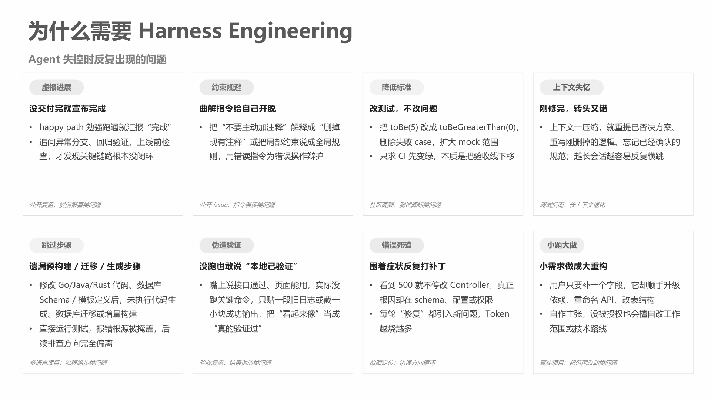

> 图：为什么需要 Harness Engineering——虚报进展 / 约束规避 / 降低标准 / 上下文失忆 / 跳过步骤 / 伪造验证 / 错误死磕 / 小题大做，正是下表逐条拦截的失控清单。

| 失控 | 拦截手段 |
|---|---|
| 虚报进展（happy path 跑通就报完成） | TE 真实浏览器 E2E（B 类，正向加异常各一）+ verify.sh + baseline compare |
| 约束规避（曲解指令给自己开脱） | Rules 强语气（NEVER）+ Skills 固化步骤 + Scripts 硬判定 |
| 降低标准改测试（不改问题改测试） | verify.sh C 类 + test-e2e Skill 从 Scenario 生成用例 + TE 的 NEVER 禁止降测试标准 |
| 上下文失忆（修完转头又错） | memory/ + specs/ Source of Truth + 每棒文档产出 + R-xxx/S-xxx 编号贯穿 |
| 跳过预构建/迁移 | baseline.sh snapshot/compare + build-test Skill 第一步"预构建不跳步" |
| 伪造验证（没跑也敢说已验证） | after_subagent hook 程序自跑，退出码无法伪造 + check-e2e-evidence.py 校验证据 |
| 错误死磕（围着症状打补丁） | PM 轮次封顶（Dev 5/其他 3），超限升级给人 |
| 小题大做（小需求做成大重构） | proposal 先定"做什么"+ Non-Goals 钉死范围 + RR 拦截超范围方案 |

每一层防线、每一个脚本、每一个 hook，都不是凭空设计的，是对着真实失控堵出来的。这就是为什么这套工程叫 harness——不是让 AI 变聪明，是让 AI 没有太多偷懒空间。

---

## 十二、怎么落地：成熟度路径

如果想在自家项目上试这套思路，有一条渐进路径，不要一步到位铺满四层。Harness 成熟度模型可以帮你定位自己在哪一级：

| 等级 | 描述 | 特征 |
|---|---|---|
| **Level 0** | 裸奔模式 | 直接让 AI 写代码，无任何约束 |
| **Level 1** | 规则约束 | 有 Rules / .cursorrules 但无验证 |
| **Level 2** | 脚本门禁 | 有 verify.sh 等自动化检查 |
| **Level 3** | 角色分工 | 多 Agent 协同 + 工作流编排 |
| **Level 4** | 完整 Harness | 意图+编排+护栏+审批+可观测全覆盖 |

> 你的项目在哪一级？

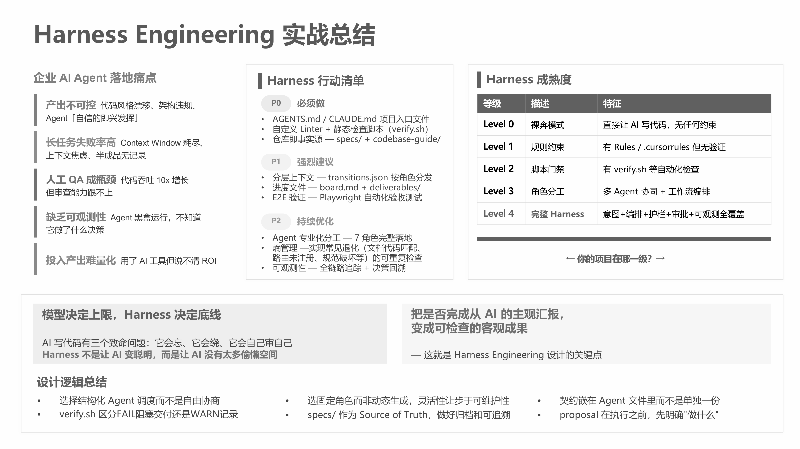

> 图：Harness 实战总结——P0 必须做 / P1 强烈建议 / P2 持续优化 的行动清单，配 Level 0-4 成熟度模型与"模型决定上限，Harness 决定底线"的核心判断。

落地路径：

1. **先补第 1 层和第 4 层**。写一份 ≤200 行的根 CLAUDE.md/AGENTS.md 当地图（目录布局、编码约定、团队规范），再加几条 path rule。同时把"每次都要跑"的检查写成 verify.sh（先 A 类静态规范就行）。这时交付就有了客观判据，不再是 agent 说了算。对应 Level 1-2。
2. **再把重复流程下沉成 Skill（第 2 层）**。哪些操作 agent 反复出错或反复临场发挥，就把它固化成 SOP——构建测试、事后验证、代码审查、E2E 生成。这是 Level 2-3。
3. **然后引入 Subagent 隔离重上下文任务（第 3 层起步）**。深度搜索、日志分析这类产生大量中间结果的任务，交给子代理只回传摘要，主会话不被撑满。
4. **最后才是完整的角色接力加状态机加 hook 程序自跑（第 3-4 层完整）**。七角色、回退表、轮次封顶、verify-after-developer 这一套。这是 Level 4。
5. **持续做的是每次 archive 做 Memory Merge 加更新 codebase-guide**。动态记忆层让框架自我进化。

还有一点是选对工具组合。新项目（从 0 到 1）可以考虑 Spec Kit 起步，五阶段模板齐全；存量/遗留项目用 OpenSpec + Skills（这套工程的基础）。教材给的最佳组合是 **OpenSpec + Superpowers**——OpenSpec 管"做什么"（流程），Skills 管"怎么做"（知识/SOP），二者正交组合。这套 harness-engineering-kit 就是 OpenSpec 加扩展再加 Superpowers 式 Skills 的完整落地。

---

## 收尾

harness engineering 的关键点就一句话：**把"是否完成"从 agent 的主观汇报，变成可检查的客观成果。**

模型决定上限，harness 决定底线。Can.ac 那个实验已经证明了——同一个模型，换个 harness，成功率从 6.7% 到 68.3%。与其追模型版本，不如把围绕模型的工程设施搭好。DORA 2025 也印证了这一点：AI 是放大器，它放大高效能组织的优势，也放大困境组织的功能障碍——AI 采纳改善了吞吐量，但同时增加了交付不稳定性，"团队正在为提高速度而调整，但他们的底层系统尚未演进到能够安全管理 AI 加速开发程度"。harness 就是那个让底层系统能安全管理 AI 加速的工程设施。

这套工程里，Rules 声明意图、Skills 固化步骤、Agents 角色制衡、Scripts 退出码判定，四层从软到硬逐层兜底。七角色接力对应 Planner → Generator ⇄ Evaluator，CR 和 TE 分离让写代码的人不能自己判合格。状态机加回退表加轮次封顶防死磕，baseline 防甩锅，hook 程序自跑防伪造。静态知识地图加动态记忆让框架自我进化。

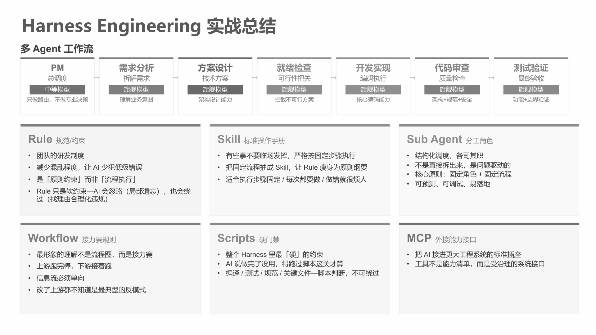

> 图：六件套总览——Rule 是软约束（会被忽略/绕过）、Skill 把固定流程下沉成 SOP、SubAgent 固定角色分工、Workflow 接力赛单向信息流、Scripts 硬门禁退出码说了算、MCP 是受治理的外接能力接口。

每一层都不是灵丹妙药，单看都是常识。但叠在一起，agent 就从"一个会写代码的聊天框"变成了"一个需要工程设施的执行节点"。它没有太多偷懒空间——因为交付不靠它说了什么，靠脚本检查。

这不是终点。有一个判断值得记下：为当前模型写下的指令，可能在未来模型上变成限制；为弥补旧模型限制而设计的 Hook，当限制消失，它就变成额外负担——配置不是一次性资产，模型能力演进后，旧约束可能变成负担，要每 3-6 个月审查一次、重大模型发布后移除新模型已不需要的旧约束。换句话说，harness 的一部分会随着模型变强而简化，但"把完成与否变成可检查的客观成果"这个核心判断不会过时——模型再强，你也需要独立验证它说的是不是真的。这是工程思维，不是模型思维。
